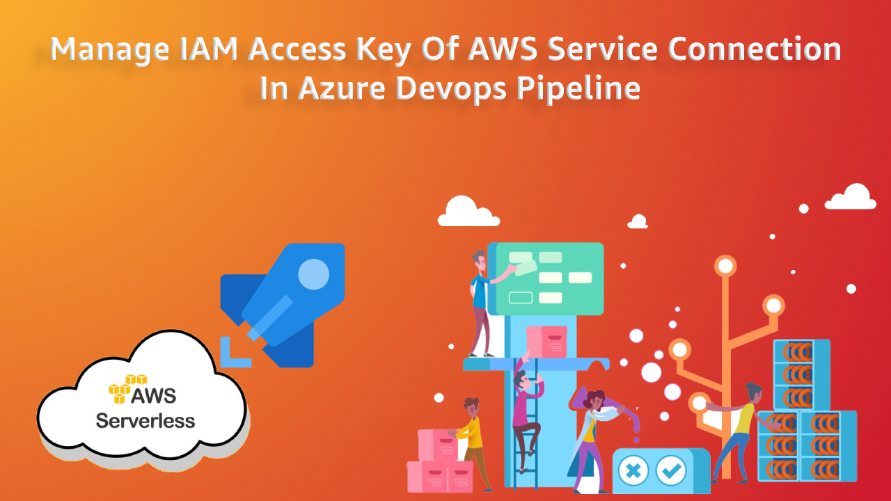

<p align="center">
  <a href="https://dev.to/vumdao">
    
  </a>
</p>
<h1 align="center">
  <div><b>Manage IAM Access Key Of AWS Service Connection In Azure DevOps Pipeline</b></div>
</h1>

## Abstract
- Service Connection represents a Service Principal in Azure DevOps, an identity which uses Headless authentication.
- We create a connection from Azure Pipelines for external and remote services to execute tasks in a job. Once you establish a connection, you can view, edit, and add security to the service connection.
- To make Azure DevOps (ADO) work with AWS services we install the plugin AWS Toolkit for Microsoft Azure DevOps which contains tasks you can use in build and release definitions in Azure DevOps to interact with AWS services (Especially when ADO agent is not EC2 instances which can assume instance profile)
- When we create a service connection with AWS type in ADO, we need to create AWS account and fill out the Access key and credential key for the service connection to access AWS service.
- It is recommended to rotate IAM access keys periodically as a security best practice. In this blog post, you will learn about how to create AWS service connection with the least privilege and security best practice and how to rotate the access key automatically using AWS serverless services such as AWS lambda, Eventbridge rule and AWS Stepfunction.

## Table Of Contents
 * [AWS Step function overview](#aws-step-function-overview)
 * [Process flow detail](#Process-flow-detail)
 * [Test the step function](#test-the-step-function)
 * [Conclusion](#Conclusion)

---

## 🚀 **Solution overview** <a name="Solution-overview"></a>


- IAM access key is used by Azure DevOps pipeline to manage AWS development resources as well as some production resources, so it should be rotated weekly. And to reduce the impact towards the pipeline jobs, we schedule this operation on Sunday.
- The operation is orchestrated by AWS stepfunction which is ingested by lambda functions to handle rotating access keys, store the access key in Secret Manager and update the new access key to Azure DevOps service connection (AWS type), finally, send the result status to the slack channel.
- The operation also requires ADO credentials such as personal access token (PAT), workspace URL, and project ID which are stored in SSM parameter store.

## 🚀 **Process flow detail** <a name="Process-flow-detail"></a>
- Scheduled Eventbridge rule weekly trigger step function on Sunday

- Step function executes the state machine which includes
  1. Invoke lambda function to create a new access key -> delete old one -> Update credential of new access key to secret manager
  2. Invoke lambda function to re-create Azure DevOps service endpoint based on the new Access key and credential from the secret manager and PAT from parameter store.
  3. Invoke lambda function to send slack message of result status

  ### 🚀 **Lambda function - Rotate Access key and update to secret manager** <a name="Lambda-function---Rotate-Access-key-and-update-to-secret-manager"></a>
  - Source handler [rotate-access-key.py](https://ap-northeast-2.console.aws.amazon.com/codesuite/codecommit/repositories/azure-DevOps-iam-user/browse/refs/heads/master/--/src/rotate-access-key/lambda-handler/rotate-access-key.py?region=ap-northeast-2)
  - The functions requires IAM service-role which has permission to Create/Delete IAM Access key and put to secret manager.

  ### 🚀 **Lambda function - Send to slack** <a name="Lambda-function---Send-to-slack"></a>
  - Source handler [send-slack.py](https://ap-northeast-2.console.aws.amazon.com/codesuite/codecommit/repositories/azure-DevOps-iam-user/browse/refs/heads/master/--/src/rotate-access-key/lambda-handler/send-slack/send-slack.py?region=ap-northeast-2)
  - The function require IAM service-role which has permission to get Slack webhook URL from parameter store

  ### 🚀 **Lambda function - Azure DevOps service connection** <a name="Lambda-function---Azure-DevOps-service-connection"></a>
  1. Solution of creating Azure DevOps service connection - Using lambda function, but there are two ways for this
    - Build lambda custom layer which contains Azure DevOps Python module to run Azure DevOps CLI
    - Build docker lambda container image

  2. Challenges
    - Why do we have challenges here? Big issue [azure-cli package could lose some weight](https://github.com/Azure/azure-cli/issues/7387). At the time of writing this post, installing or packaging azure-cli takes more than 1GB size which is too big for the lambda function, especially custom lambda layer has a limit of 250 MB (unzipped) for the deployment zip file
    - Fortunately, there is a workaround to reduce the size of the docker image by just installing enough Azure cli libraries

  3. Build lambda container image using codepipeline
    - [Dockerfile](https://ap-northeast-2.console.aws.amazon.com/codesuite/codecommit/repositories/azure-DevOps-iam-user/browse/refs/heads/master/--/src/docker/Dockerfile?region=ap-northeast-2) which builds container image just about `299.41 MB`. The lambda container image plays as azure CLI to run `azure DevOps` commands
    - For CI, build and automate deploy to lambda docker container image, we use Codepipeline with the following stages
      - Pull Source code for commit merge to master
      - Trigger codebuild with [buildspec.yml](https://ap-northeast-2.console.aws.amazon.com/codesuite/codecommit/repositories/azure-DevOps-iam-user/browse/refs/heads/master/--/src/docker/buildspec.yml?region=ap-northeast-2)

        

  4. We can use [azure-DevOps-Python-api](https://github.com/microsoft/azure-DevOps-Python-api) to write Python code for handling ADO service connection but using its wrapper tool such as Azure DevOps CLI is much more convenient so I write bash script [run.sh](https://ap-northeast-2.console.aws.amazon.com/codesuite/codecommit/repositories/azure-DevOps-iam-user/browse/refs/heads/master/--/src/docker/run.sh?region=ap-northeast-2) and use Python to execute it
      ```
      subprocess.check_call(f"export AZURE_DevOps_EXT_PAT={_pat}; ./run.sh {access_key} {cred}", shell=True)
      ```

## 🚀 **Test the step function** <a name="Test-the-step-function"></a>
- Pre-requisite: You need to deploy pipeline stack first, push code to codecommit so that it will trigger pipeline to deploy stacks and trigger build/push/update container image
- Let's check the full diagram

  

- Manually trigger `start execution` of the state machines to test

  

  - Failed case

    

    

  - Success case -> Trigger a sample Azure DevOps pipeline which uses AWS resources to test

    

    

## 🚀 Conclusion
- We now have an automated way to weekly rotate AWS access key of Azure DevOps service connection. Any failed state/steps are alerted to slack with detail of which the failed step is and the error message.
- You should aware that the `simflexcloud-d1-azure-devops-sfn-rotate-key-task` task does not include AWS Credential key in its `Output` due to security, so it must get that value from the Secret Manager

---

References:
- [How to trim a container image that includes Azure CLI](https://usrme.xyz/posts/how-to-trim-a-container-image-that-includes-azure-cli/)
- [AWS IAM Key Rotation](https://github.com/aws-samples/aws-iam-access-key-auto-rotation)

---

<h3 align="center">
  <a href="https://dev.to/vumdao">:stars: Blog</a>
  <span> · </span>
  <a href="https://github.com/vumdao/azure-DevOps-rotate-iam-access-key">Github</a>
  <span> · </span>
  <a href="https://stackoverflow.com/users/11430272/vumdao">stackoverflow</a>
  <span> · </span>
  <a href="https://www.linkedin.com/in/vu-dao-9280ab43/">Linkedin</a>
  <span> · </span>
  <a href="https://www.linkedin.com/groups/12488649/">Group</a>
  <span> · </span>
  <a href="https://www.facebook.com/groups/1322673354735591">Page</a>
  <span> · </span>
  <a href="https://twitter.com/VuDao81124667">Twitter :stars:</a>
</h3>